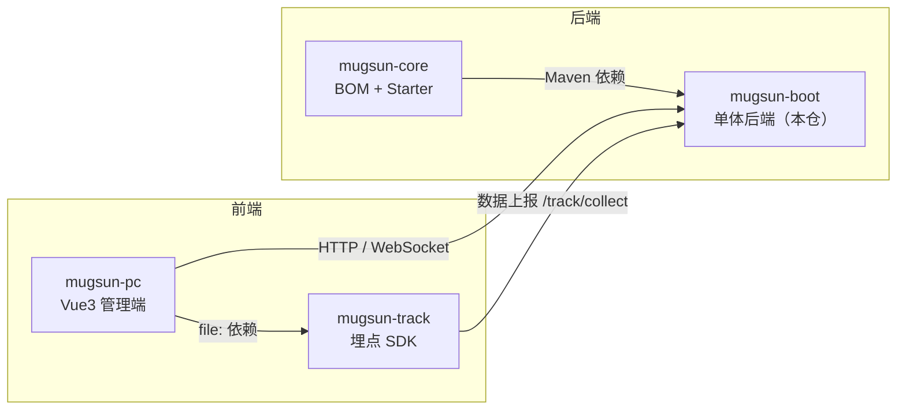
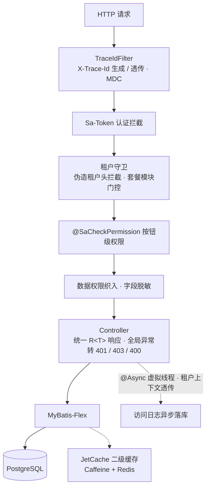

# mugsun-boot

**中文** | [English](README_EN.md)


mugsun 平台的单体后端，将系统管理、工作流、多租户、开放平台与埋点分析集成在一个可执行应用中，`mvn spring-boot:run` 即可本地启动，首次启动后功能完整可用。

基于 JDK 21 虚拟线程与 Spring Boot 3.5 构建，内置国密 SM2/SM3/SM4 加密体系与全链路审计，Flyway 管理数据库 schema。

## 功能

| 分组 | 能力 |
| --- | --- |
| 系统管理 | 用户 / 角色 / 菜单 / 部门 / 岗位 / 字典 / 业务字典 / 参数 / 行政区划 |
| 消息中心 | 站内信、邮件、短信模板统一调度，WebSocket 实时推送 |
| 文件存储 | 本地 / MinIO / 云平台多云存储，私有附件授权下载 |
| 低代码 | 代码生成器、动态建表、在线表单、表单设计器 |
| 工作流 | 可视化流程设计器、条件路由与并行会签、待办工作台、审批中心 |
| 监控运维 | 服务监控、操作 / 登录 / 访问 / 错误日志、在线会话、缓存管理、定时任务 |
| 数据变更审计 | SM3 哈希链与 SM2 签名防篡改，diff 时间轴回溯 |
| 开放平台 | OAuth2 授权码 + PKCE、API 密钥、HMAC + nonce 防重放、调用日志 |
| 埋点分析 | 事件采集，概览 / 事件 / 性能 / 错误监控（sourcemap 还原与告警）、会话回放、行为细查、漏斗、留存、圈选式可视化埋点 |
| 租户运营 | 字段隔离与独立数据源三种策略、套餐菜单收窄、客户管理 |
| 安全 | 国密传输加密、字段级脱敏、数据权限、弱密码策略与双因子、接口防重放 |

## 技术栈

JDK 21（虚拟线程）· Spring Boot 3.5 · MyBatis-Flex · Sa-Token · JetCache · Warm-Flow · PostgreSQL 16（主推）· Redis 7 · PowerJob · springdoc-openapi · x-file-storage · SMS4J · Hutool · LiteFlow · Flyway · 国密 SM2/SM3/SM4

## 仓库全景

mugsun 由四个仓库组成，本仓是后端主体。四个仓库需平级 clone，放在同一目录下：



## 请求处理管线

所有请求经过统一的治理链路，可观测性与安全控制在框架层实现：



## 快速开始

### 环境要求

- JDK 21+
- Maven 3.9+
- PostgreSQL 16
- Redis 7

### 1. 基础设施（Docker Compose）

```bash
# 在 mugsun-boot 目录：拉起 Postgres 16（mugsun-pg）与 Redis 7（blade-redis）
docker compose up -d
```

脚本会创建 `mugsun` 账号、主库 `mugsun` 与埋点库 `mugsun_track`，并授予 CREATEDB 权限。本机已有 PostgreSQL 时也可执行 `psql -U postgres -f scripts/init-db.sql`。

### 2. 构建内核

```bash
cd ../mugsun-core && mvn clean install -DskipTests && cd ../mugsun-boot
```

### 3. 本地配置（建议执行）

```bash
cp config/application-local.yml.example config/application-local.yml
# 写入固定 SM2 密钥对；留空则每次启动临时生成，登录会不稳定
```

`application-local.yml` 已被 gitignore。`mvn spring-boot:run` 会自动 import `./config/application-local.yml`（工作目录须为 `mugsun-boot`），用于固定密钥并通过 `show-code: true` 回显验证码。

OAuth 同意页跳转地址取自 `mugsun.web.front-url`（环境变量 `MUGSUN_FRONT_URL`）。日常前端 `:3006` 使用默认值；e2e 使用 `:3007` 时须设置 `MUGSUN_FRONT_URL=http://localhost:3007`。

PowerJob Worker 默认关闭。定时任务页依赖独立的 PowerJob Server（`127.0.0.1:7700`），未启动时接口返回业务错误而非 500。需要 Worker 时设置 `POWERJOB_ENABLED=true` 并确保 Server 已启动。

### 4. 启动

```bash
mvn spring-boot:run
```

Flyway 会执行 70 余个迁移脚本与菜单种子数据，首次启动即为完整系统。API 文档见 `http://localhost:8080/swagger-ui/index.html`（prod 环境自动关闭）。

### 5. 登录

默认账号仅 `admin / 123456`，可通过环境变量 `MUGSUN_INIT_PASSWORD` 覆盖，**生产部署必须修改**。冷启动不播种 `fronttest`，该账号仅在 `mugsun.lab.seed-fronttest` 打开时生成，默认关闭。

### 6. 前端

管理端见 [mugsun-pc](https://github.com/mugsun/mugsun-pc)，按其四仓平级 clone 说明启动即可对接本服务。

## 生产部署

启用 prod profile：`--spring.profiles.active=prod`。

- `application-prod.yml` 全量使用环境变量注入（数据源、Redis、SMTP、短信、存储、密钥、`MUGSUN_FRONT_URL`），仓库内不保存明文配置
- `mugsun.crypto.strict-keys=true`：SM4 / SM2 / 审计签名密钥缺失时拒绝启动
- Actuator 默认 fail-closed，仅放行 `health`，指标端点需登录授权
- API 文档（springdoc）在 prod 环境自动关闭
- 生产环境禁用本地文件匿名直出，私有附件全部走授权流式下载

## 测试与质量

- **后端集成测试**：基于 Testcontainers 自动拉起 PostgreSQL 16 与 Redis 7 容器隔离运行，`mvn test` 无外部依赖，覆盖登录、权限、租户、工作流、报表、帮助反馈链路，共 30 个测试类
- **前端 e2e**：Playwright 端到端 140 余个用例，含流程、租户、OAuth 专属 spec
- **api-probe 探针**：性能探针在 10 万行日志表上实测 p95 ≤ 69ms；50 项安全探针全部通过

## 路线图（规划中）

- 微服务形态
- AI 增强能力（模型接入、对话、知识库）

## 贡献

欢迎提交 Issue 与 Pull Request。提交前请确保 `mvn test` 通过，新增功能请附带测试。

提交信息规范见 [.github/COMMIT_CONVENTION.md](.github/COMMIT_CONVENTION.md)。

## Star History

[](https://star-history.com/#mugsun/mugsun-boot&Date)

## 许可证

[Apache License 2.0](LICENSE)
