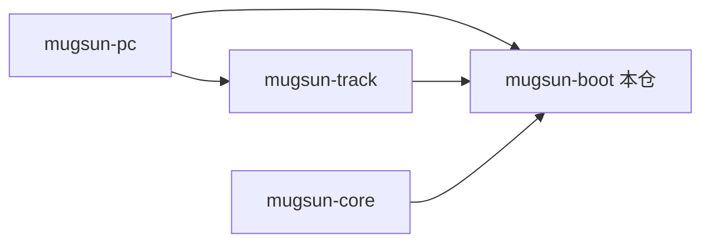
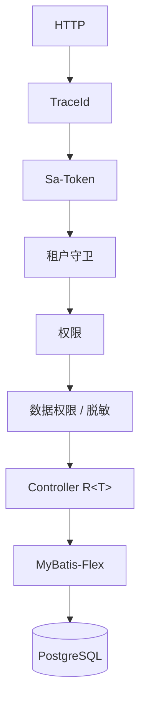

# mugsun-boot

**中文** | [English](README_EN.md)


Mugsun 的单体后端：系统管理、工作流、多租户、开放平台、埋点分析打在一个 Spring Boot 应用里。`mvn spring-boot:run` 即可本地跑。

JDK 21 虚拟线程，Spring Boot 3.5，国密 SM2/SM3/SM4，Flyway 管 schema。

## 功能

| 分组 | 能力 |
| --- | --- |
| 系统管理 | 用户 / 角色 / 菜单 / 部门 / 岗位 / 字典 / 参数 / 区划 |
| 消息 | 站内信、邮件、短信模板，WebSocket 推送 |
| 存储 | 本地 / MinIO / 云存储，私有附件授权下载 |
| 低代码 | 代码生成、动态建表、在线表单、表单设计 |
| 工作流 | Warm-Flow 设计器，条件/并行/会签，待办与审批中心 |
| 运维 | 服务监控、各类日志、在线会话、缓存、PowerJob 定时任务 |
| 审计 | SM3 哈希链 + SM2 签名，变更 diff 时间轴 |
| 开放平台 | OAuth2 + PKCE、API Key、HMAC 防重放、调用日志 |
| 埋点 | 采集入库、概览/事件/性能/错误/回放/漏斗/留存、圈选埋点 |
| 租户 | 字段隔离 / 独立库 / schema，套餐菜单、客户管理 |
| 安全 | 传输加密、字段脱敏、数据权限、弱密码与 2FA、防重放 |

## 技术栈

JDK 21 · Spring Boot 3.5 · MyBatis-Flex · Sa-Token · JetCache · Warm-Flow · PostgreSQL 16 · Redis 7 · PowerJob · Flyway · 国密

## 仓库关系



四仓平级 clone 在同一目录下。

## 请求链路



## 快速开始

### 环境

JDK 21+、Maven 3.9+、PostgreSQL 16、Redis 7

### 1. Docker 起库

```bash
docker compose up -d
```

会建 `mugsun-pg`、`blade-redis`，库 `mugsun` 与 `mugsun_track`。已有 Postgres 也可：`psql -U postgres -f scripts/init-db.sql`。

### 2. 构建 core

```bash
cd ../mugsun-core && mvn clean install -DskipTests && cd ../mugsun-boot
```

### 3. 本地配置

```bash
cp config/application-local.yml.example config/application-local.yml
# 写入固定 SM2 密钥；留空则每次启动临时生成，登录会不稳定
```

`application-local.yml` 已 gitignore。`mvn spring-boot:run` 会自动 import 它（工作目录须在 `mugsun-boot`）。

OAuth 同意页跳转看 `mugsun.web.front-url`（`MUGSUN_FRONT_URL`）。前端 e2e 用 3007 时要设 `http://localhost:3007`。

PowerJob Worker 默认关。要定时任务页正常工作需另起 PowerJob Server（`:7700`）。

### 4. 启动

```bash
mvn spring-boot:run
```

Flyway 跑迁移和菜单种子。Swagger：`http://localhost:8080/swagger-ui/index.html`（prod 关）。

### 5. 登录

默认 `admin / 123456`，可用 `MUGSUN_INIT_PASSWORD` 覆盖。**上线务必改密码。**

### 6. 前端

见 [mugsun-pc](https://github.com/mugsun/mugsun-pc)。

## 生产

`--spring.profiles.active=prod`：

- 配置走环境变量，仓库无明文
- `mugsun.crypto.strict-keys=true`，密钥缺失拒绝启动
- Actuator 默认只开 health
- springdoc 关闭
- 私有附件走授权下载

## 测试

- 集成测试：Testcontainers 起 PG/Redis，`mvn test`，约 30 个测试类
- 前端 e2e：见 mugsun-pc，140+ 用例
- api-probe：性能与安全探针（见仓库脚本）

## 规划

微服务拆分、AI 相关能力（未排期）

## 贡献

Issue / PR 欢迎。提交前 `mvn test` 通过；新功能尽量带测试。

提交信息写法见 [.github/COMMIT_CONVENTION.md](.github/COMMIT_CONVENTION.md)。

## Star History

[](https://star-history.com/#mugsun/mugsun-boot&Date)

## 许可证

[Apache License 2.0](LICENSE)
