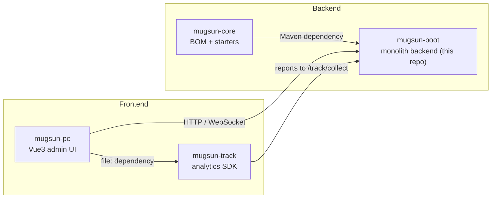
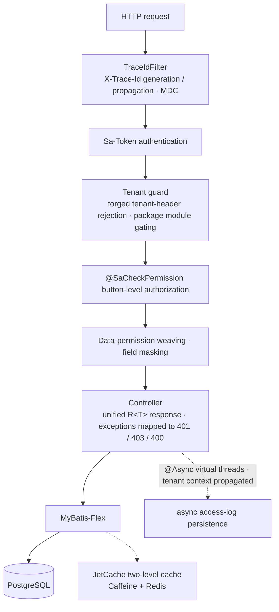

# mugsun-boot

[中文](README.md) | **English**


**The monolithic backend of the Mugsun low-code rapid-development platform** — system administration, workflow, multi-tenancy, an open platform, and product analytics packed into a single executable. Run `mvn spring-boot:run` and a complete system comes alive on first boot.

Built on JDK 21 virtual threads and Spring Boot 3.5, with SM2/SM3/SM4 cryptography and end-to-end auditability baked in — production-grade from day one.

## ✨ Features

| Area | Capabilities |
| --- | --- |
| 🏢 System Admin | Users, roles, menus, departments, positions, dictionaries, business dictionaries, parameters, administrative divisions |
| 📨 Messaging | Unified in-app / email / SMS template delivery with real-time WebSocket push |
| 📦 File Storage | Local / MinIO / cloud object storage with authorized downloads for private attachments |
| 🧩 Low-Code | Code generator, dynamic DDL, online forms, form designer |
| 🔀 Workflow | Visual flow designer, conditional routing, parallel countersigning, todo workbench, approval center |
| 📊 Ops & Monitoring | Server metrics, operation / login / access / error logs, online sessions, cache management, scheduled jobs |
| 🔏 Change Audit | Tamper-evident SM3 hash chain with SM2 signatures, field-level diff timeline |
| 🌐 Open Platform | OAuth2 authorization code + PKCE, API keys, HMAC + nonce replay protection, call logging |
| 📈 Analytics | Event collection, overview / event / performance / error monitoring (sourcemap restore + alerting), session replay, behavior drill-down, funnels, retention, visual point-and-select tracking |
| 🏷 Tenant Operations | Three isolation strategies (column-based / separate datasource), package-driven menu narrowing, customer management |
| 🛡 Security | Encrypted transport with Chinese national ciphers, field-level masking, data permissions, weak-password policy + 2FA, request replay protection |

## 🧱 Tech Stack

JDK 21 (virtual threads) · Spring Boot 3.5 · MyBatis-Flex · Sa-Token · JetCache · Warm-Flow · PostgreSQL 16 (recommended) · Redis 7 · PowerJob · springdoc-openapi · x-file-storage · SMS4J · Hutool · LiteFlow · Flyway · SM2/SM3/SM4 cryptography

## 🗂 Repository Map

Mugsun is split across four repositories; this one is the backend. Clone all four **side by side** (into the same parent directory):



## 🔄 Request Pipeline

Every request flows through a single governance chain, so observability and security are solved once at the framework level:



## 🚀 Quick Start

### Prerequisites

- JDK 21+
- Maven 3.9+
- PostgreSQL 16
- Redis 7

### 1. Infrastructure (Docker Compose)

```bash
# From the mugsun-boot directory: Postgres 16 (mugsun-pg) + Redis 7 (blade-redis)
docker compose up -d
```

This creates the `mugsun` role, the `mugsun` primary database, and `mugsun_track`, and grants CREATEDB. If you already have PostgreSQL locally: `psql -U postgres -f scripts/init-db.sql`.

### 2. Build the core

```bash
cd ../mugsun-core && mvn clean install -DskipTests && cd ../mugsun-boot
```

### 3. Local config (recommended)

```bash
cp config/application-local.yml.example config/application-local.yml
# Fill in a fixed SM2 key pair (empty keys generate a new pair on every boot — login will flake)
```

`application-local.yml` is gitignored. `mvn spring-boot:run` **auto-imports** `./config/application-local.yml` when the working directory is `mugsun-boot`. That file pins crypto keys and sets `show-code: true` so captchas echo in the JSON.

The OAuth consent redirect uses `mugsun.web.front-url` (`MUGSUN_FRONT_URL`). Daily UI on `:3006` can keep the default; e2e on `:3007` must set `MUGSUN_FRONT_URL=http://localhost:3007`.

The PowerJob worker is **off by default**. The job admin page talks to a standalone PowerJob Server (`127.0.0.1:7700`); if it is down the API returns a business error instead of HTTP 500. Enable the worker with `POWERJOB_ENABLED=true` only when the Server is up.

### 4. Run

```bash
mvn spring-boot:run
```

Flyway automatically applies 70+ migrations plus menu seed data, so the very first boot is already a complete system. API docs live at `http://localhost:8080/swagger-ui/index.html` (disabled under the prod profile).

### 5. Sign in

The only seeded account is **`admin / 123456`**. Override with `MUGSUN_INIT_PASSWORD` — **you must change this in production**. `fronttest` is not seeded on a cold start (it is created only when `mugsun.lab.seed-fronttest` is on).

### 6. Frontend

The admin UI lives in [mugsun-pc](https://github.com/mugsun/mugsun-pc). Follow its side-by-side clone instructions to connect it to this service.

## 🛡 Production Deployment

Activate the prod profile: `--spring.profiles.active=prod`.

- `application-prod.yml` reads everything from environment variables (datasources / Redis / SMTP / SMS / storage / keys / `MUGSUN_FRONT_URL`) — no plaintext secrets in the repo
- `mugsun.crypto.strict-keys=true`: startup fails fast if any SM4 / SM2 / audit-signing key is missing
- Actuator is fail-closed by default; only `health` is public, and metric endpoints require authenticated authorization
- springdoc API docs are disabled automatically in prod
- Anonymous local-file access is off; private attachments stream through authorized downloads only

## 🧪 Testing & Quality

- **Backend integration tests**: powered by Testcontainers — isolated PostgreSQL 16 / Redis 7 containers, zero external dependencies for `mvn test`, covering real login / permission / tenant / workflow / report / help-feedback flows (30 test classes)
- **Frontend e2e**: 140+ Playwright end-to-end cases (including dedicated flow / tenant / OAuth specs)
- **api-probe**: performance probes hold p95 ≤ 69ms against a 100k-row log table; all 50 security probes pass

## 🗺 Roadmap (planned)

- Microservice distribution
- AI-powered capabilities (model integration / chat / knowledge base)

## 🤝 Contributing

Issues and pull requests are welcome. Please make sure `mvn test` stays green and include tests for new features.

## ⭐ Star History

[](https://star-history.com/#mugsun/mugsun-boot&Date)

## 📄 License

[Apache License 2.0](LICENSE)

---

If this project helps you, a star ⭐ means a lot!
